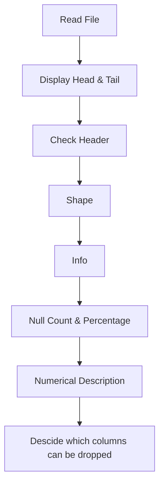

# Read and Preliminary Analysis of Dataset

1. **_Read_** the input file
2. Check for the data consistency by **_displaying head and tail_** data
3. If required, _**Remove the extra rows**_ at the top or bottom (Extra rows at top is sometime added with header while Extra row at the bottom are added as total)
4. Check the **_Shape_** of the dataframe
5. Check the _**Size**_ of the dataframe
6. Check the _**Null count**_ and **_Null Percentage_**
7. Check the _**Numerical Description**_ using .describe()



### Read CSV
```
df= pd.read_csv("File_Name or URL")
df
```

### Read CSV without first 2 Rows
```

df= pd.read_csv("CSV_FIle_Name",skiprows = 2)
df.head()
```

### Display Head & Tail data
```
df.head()
```
```
df.tail()
```
```
df.head().append(df.tail())
```


### Count of Rows and Columns
```
print("Shape of dataframe: ",df.shape)

print('Number of Attributes: %s' %df.shape[1])
print('Number of Rowa: %s' %df.shape[0])

```


### Checking Null and Data Type

* With this we get an idea of Data Type for each attribute, and can judge if we need to change the data type for any of them
* Non-Null Count gives an idea of where there are null values
* 

```
df.info()

```


### Column wise Null Count

* This gives the exact Null count in each Column
```
df.isnull().sum()
```


### Column wise Null Percentage 
```
percent = 100*(df.isnull().sum())/int(df.shape[0])
percent.sort_values(ascending=False)
```


### Numerical Description

* Run `df.describe()` to get 5 Number summary of each attribute without outliner
* This includes Min, Max, 25%, 50% (Median), 75%, Max, Count, Std, Mean
* If Mean deviates a lot from Median(50%), try to identify Outliner and there are more chances of Median Imputation

```
df.describe()
```


### Drop Columns

* We may decide to not analyse few columns which are visibly non-relevent for our analysis, So drop them before cleaning or in first step of cleaning
```
data.drop(['clm1','clm2','clm3'],axis=1,inplace=True)


```
