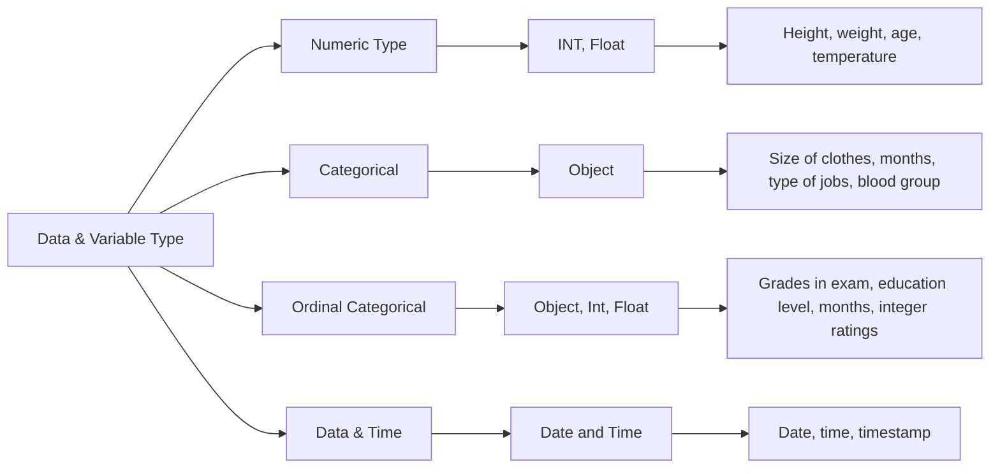
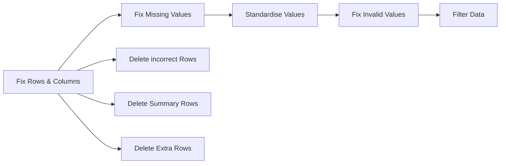
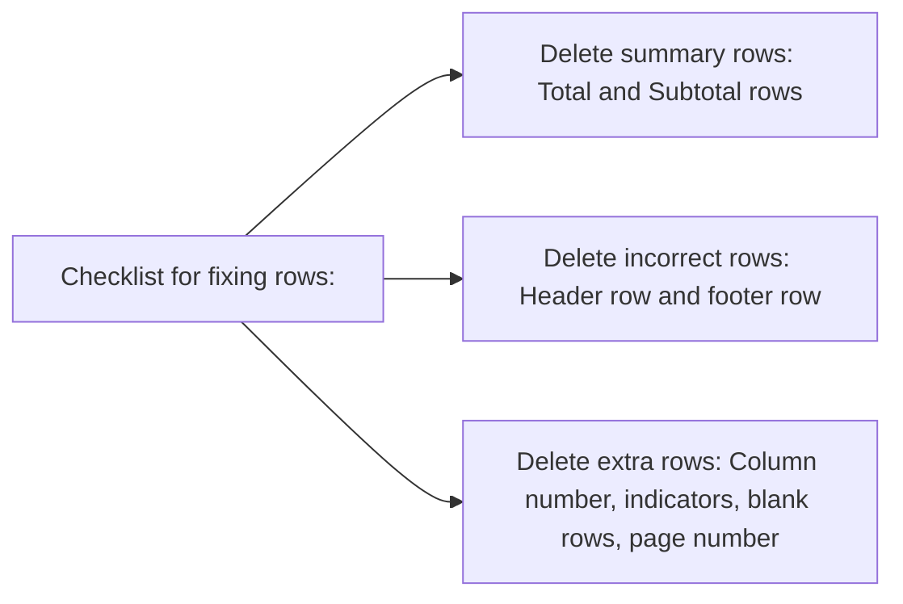
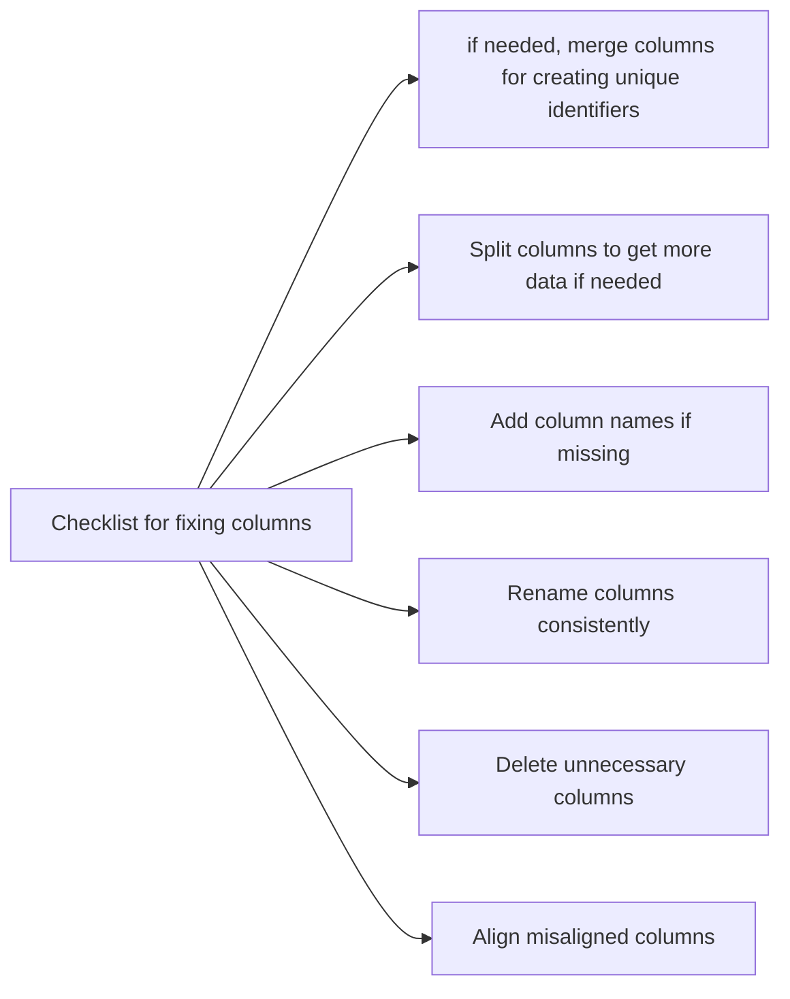
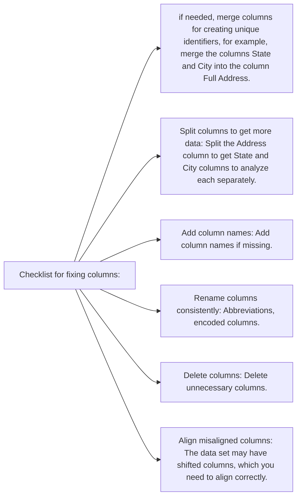

## Problem statement

The bank provides financial services/products such as savings accounts, current accounts, debit cards, etc. to its customers.
In order to increase its overall revenue, the bank conducts various marketing campaigns for its financial products such as credit cards, term deposits, loans, etc.
These campaigns are intended for the bank’s existing customers.
However, the marketing campaigns need to be cost-efficient so that the bank not only increases their overall revenues but also the total profit.


We need to apply our knowledge of EDA on the given dataset to analyse the patterns and provide inferences/solutions for the future marketing campaigns.

### Background
A bank has conducted a telemarketing campaign for one of its financial products called ‘Term Deposits’ to help foster long-term relationships with existing customers. The dataset contains information about all the customers who were contacted during a particular year to open term deposit accounts with the bank.

 

> What is a term deposit?

>> Term deposits, also called fixed deposits, are the cash investments made for a specific time period ranging from 1 month to 5 years for predetermined fixed interest rates. The fixed interest rates offered for term deposits are higher than the regular interest rates for savings accounts. The customers receive the total amount (investment plus the interest) at the end of the maturity period. Also, the money can only be withdrawn at the end of the maturity period. Withdrawing money before that will result in penalty charges, and the customer will not receive any interest returns.

> Tools Used: Python Libraries
>> Pandas: It is a library to deal with dataframes in Python. Pandas is an acronym derived from panel data. It is solely used for data analysis purposes in Python.
>> NumPy: This library is used for performing numerical operations on a dataset.


### Dataset

#### Data Disctionary:

| 	Attributes | 	Description	 |
| 	----------- 	 | 	----------- 	 |
| 	Customer id	 | 	This column is about the id of the customer contacted	 |
| 	age	 | 	This column consists of the age of each customer	 |
| 	salary	 | 	This column represents monthly salary of the customer	 |
| 	balance	 | 	This column represents the cash balance in the bank account of the customer	 |
| 	marital	 | 	 This column consists of the information about the marital status of each customer.	 |
| 	jobedu	 | 	This column consists of the information about the job and education of each cutomer	 |
| 	targeted	 | 	If the customer should be targeted or Not	 |
| 	default 	 | 	This column consists of two categorical variables ‘yes’ & ‘no’, where            Yes - represents if the customer has defaulted any loan                                                       no  - represents if the customer has not defaulted any loan	 |
| 	housing	 | 	 This column consists of the two categorical variables ‘yes’ & ‘no’, where     yes - represents if the customer has taken housing loan                                                no  - represents if the customer has not taken the housing loan                                                                                                                              	 |
| 	loan	 | 	This column consists of the two categorical variables ‘yes’ & ‘no’, where                 yes - represents if the customer has taken personal loan                                                              no  - represents if the customer has not taken the personal loan	 |
| 	contact 	 | 	This column provides the information on the means through which the customer has been contacted either ‘cellular’ , ‘telephone’ and ‘unknown’ represents no information	 |
| 	day	 | 	day of month on which a particular customer is contacted	 |
| 	month	 | 	This column provides the detail of month in which the customer is contacted during the campaign	 |
| 	duration	 | 	 This column represents the total call duration of each customer 	 |
| 	campaign	 | 	This column is the number of campaign in which customer is contacted.	 |
| 	pdays 	 | 	This column represents  the no of days passed by since the customer has been reached via bank for any of the other products (not term deposit). Here, the value ‘-1’ represents that the customer has never been reached for any product	 |
| 	previous	 | 	This column represents the no of times the customer has been reached in the previous campaigns or for any of the other products(not term deposit)	 |
| 	poutcome	 | 	This column represents the outcome of the previous reach outs for any of the products(other than term deposits) provided by banks                                                                                                    Unknown - This represents that the customer has not been reached so far       Success - This represents that the previous call was a successful conversion of the customer                                                                                                                Failure - This represents that the customer is not interested in the last product                                                                                                                                                      Other -  This represents that during the previous call, the customer has not given any definite answer	 |
| 	response	 | 	This column represents whether the customer has opened the term deposit account or not	 |


> Data Types:





### DATA CLEANING ACTIVITIES



### Row Checklist


### Column Checklist



For banking Dataset =>




```mermaid
graph LR;
A[Fix rows and columns] --> B[Incorrect rows];				
				
A --> C[Summary rows];
A --> D[Extra rows];
A --> E[Missing Column Names];
A --> F[Inconsistent column names];
A --> G[Unnecessary columns];
A --> H[Columns containing Multiple data values];
A --> I[No Unique Identifier];
A --> J[Misaligned columns;

B --> K[Delete];
C --> L[Delete];
D --> M[Delete];
E --> N[Add the column names];
F --> O[Add  column names that give some information about the data];
G --> P[Delete];
H --> Q[Split columns into components];
I --> R[Combine columns to create unique identifiers e.g. combine City with the State];
J --> S[Align these columns];

```
