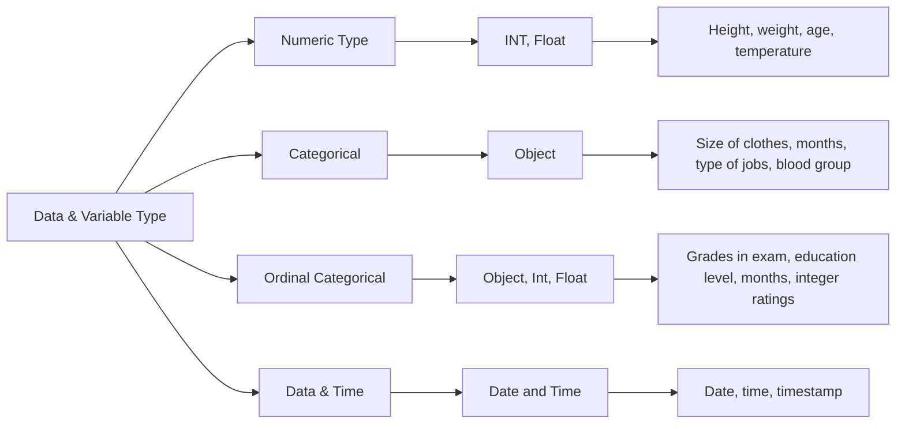

## Data Check

> Done using two most prominat python Libraries: **Numpy** & **Pandas**

### Data Types:

 ```mermaid
flowchart TD
A[Data Type] --> B[Numeric Type];

B --> C[Continuous: ];
B --> D[Discrete];

A --> E[Categorical];
A --> F[Ordinal : Categorical data in Order]
```





## Data Cleaning

#### What is data cleaning and why it is an important step in EDA?

* Data Cleaning involves getting rid of the irregularities in the data and fix it to improve its quality.
* Irregularities can be in form of:
  *  _Missing values_
  *  _Anomalies/outliers_ 
  *  _Incorrect format_ 
  *  _Incorrect header_
  *  _Inconsistent spelling_
* These irregularities may propagate further and affect the assumptions and analysis based on that dataset and hence hamper the further process of machine learning model building.


#### What can be a schematic process of Data Cleaning?

Data Cleanig steps are difficult to define in a single structured process, and varries on the user approach and dataset provided. But a few checkpoints that can be suggested for the same are:
* Identifying the data types
* Fixing the rows and columns
* Imputing/removing missing values
* Handling outliers
* Standardising the values
* Fixing invalid values
* Filtering the data


# EDA-of-Bank-Telemarketing-Campaign

### About EDA
Exploratory data analysis uses data visualisation techniques to draw inferences and obtain insights from them.
EDA is more about understanding and studying the given data in detail.
Visualisation of data into plots/graphs can be termed one of the tools in the EDA process. 

EDA should be the first step in any data science / machine learning activity. Based on the results of EDA, companies also make business decisions, which can have repercussions later. If not performed properly, EDA can hamper the further steps in the machine learning model building process. If performed well, it may improve the efficacy of all we do in the next steps.


The first task of EDA involves the preparation of data sets for analysis by removing irregularities in the data so that these irregularities do not affect further steps in the process of data analysis and machine learning model building.

 
#### Why EDA?

The major utility of EDA are as follows:

* Maximise the insight in the data set
* Detect outliers and anomalies
* Test underlying assumptions


EDA is majorly carried out with four major topics covered:

1. Data sourcing
2. Data cleaning
3. Univariate analysis
4. Bivariate and multivariate analysis

 ```mermaid
flowchart TD
A[EDA Major Steps] --> B[1. Data sourcing];

A[EDA Major Steps] --> C[2. Data cleaning];


A[EDA Major Steps] --> D[3. Univariate analysis];


A[EDA Major Steps] --> E[4. Bivariate and multivariate analysis];

```


## Data Sourcing
Broadly, data sources can be seen as one of the two types:

* Private data
* Public data
 
 ```mermaid
flowchart TD
A[Data Source] --> B[Private Data];

B[Private Data] --> H[Organisation Controlled Dataset];


A[Data Source] --> C[Public Data];
C[Public Data] --> D[Open Websites];
C[Public Data] --> E[Web Scrapping];

D[Open Websites] --> F[Kaggle];
D[Open Websites] --> G[UCI Machine Learning Repository];
```


**Private data:** 
* Private data majorly belongs to an organisation, and there are certain security and privacy concerns attached to it.
* It is used for the companies’ internal analysis purposes in order to gain business and growth insights.
* Examples: telecom data, retail data, banking and medical data.

 

**Public data:** 
* Public data are available for public use.
* They are offered by many sites such as government websites and public agencies for the purpose of research.
* Accessing this data does not require any special permission or approval.
* There are many programming techniques that are used to fetch public data through code called Data Mining.
* Some Public Data scorces are:
  * Kaggle
  * [UCI Machine Learning Repository](https://archive.ics.uci.edu/ml/index.php) 
  * [GitHub - Awesome public datasets](https://github.com/awesomedata/awesome-public-datasets)
  * [GitHub - datameet](https://github.com/datameet)


<p align="center">
Public data is not always relevant or useful, and private data is not always easily available.
</p>


### Domain Specific Data
Some Domain Specific data and there uses are as follows:
* **Banking data:** 
  * Banks use data to make credit-related decisions.
  * This data is highly sensitive, as it contains customer transaction details, account details, etc.
  * Security of such data is of topmost importance.
  * Banks can use such data to predict which customer is likely to take a loan in the near future or which customers are interested in investing in term deposits, etc. 
  * With this help of such data, banks can also identify which customers are likely to default on their loans.


* **Telecom data:**
  * Telecom companies use data to optimise plans for customers and predict customer churn.
  * Telecom data can be used to optimise the coverage area based on the customers' calls data and their call performances.


* **HR data:**
  * HR data analytics helps identify and predict employee behaviour. 

* **Retail data:** 
  * Retail data analytics helps drive decisions such as product purchasing, pricing and stocking.


* **Media data:** 
  * The media industry uses data extensively to target viewers.
  * Advertisers use data to identify the best avenues for targeting customers.
  * Journalists use data visualisation to gather relevant information.


